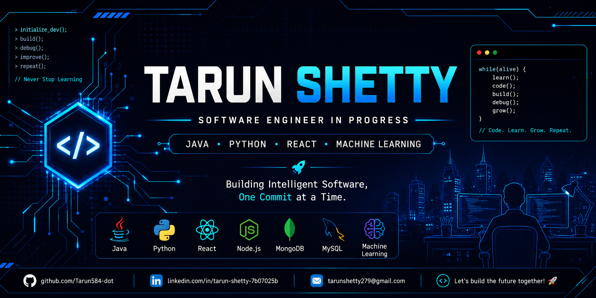

<p align="center">
  
</p>

<div align="center">

# 👋 Hi, I'm Tarun Shetty

### 🚀 Software Engineer in Progress


<p>

<a href="https://github.com/Tarun584-dot">

</a>


</p>

</div>

---

# 💻 Developer Dashboard

```text
👤 Name        : Tarun Shetty

🎓 Education   : B.E. Computer Science Engineering

📍 Location    : Karnataka, India

💡 Focus       : Full Stack Development
                 Machine Learning
                 Artificial Intelligence

🚀 Goal        : Build software that solves
                 real-world problems

🟢 Status      : Learning • Building • Growing
```

---

# 🧑‍💻 About Me

I am a **Computer Science Engineering** student passionate about creating software that solves real-world problems.

My interests include **Full Stack Development**, **Machine Learning**, and **Artificial Intelligence**.

I enjoy transforming ideas into practical applications using modern technologies. Every project in this profile represents something new I learned while improving my skills as a developer.

---
# ⚡ Tech Stack

<div align="center">

### 💻 Languages


<br><br>

### 🌐 Frontend


<br><br>

### ⚙ Backend


<br><br>

### 🗄 Database


<br><br>

### 🤖 Machine Learning


<br>

Scikit-Learn • Pandas • NumPy • Streamlit

<br><br>

### 🛠 Tools


</div>

---

# 🎯 Core Skills

```text
✔ Full Stack Web Development

✔ Machine Learning

✔ Data Analytics

✔ REST API Development

✔ Object-Oriented Programming

✔ Database Design

✔ Problem Solving
```

---

# 🚀 Featured Projects

## 🤖 AI Email Intelligence System

> **Machine Learning based email classifier**

**Tech Stack**

`Python` `Flask` `Scikit-Learn`

**Highlights**

- Categorizes emails automatically
- NLP-based text processing
- Interactive web interface

---

## 🛒 Shopping Cart Web Application

> **Modern Full Stack Shopping Platform**

**Tech Stack**

`React` `Node.js` `MongoDB`

**Highlights**

- Product catalog
- Shopping cart
- Responsive UI

---

## 🏠 House Price Prediction

> **Machine Learning Regression Project**

**Tech Stack**

`Python` `Machine Learning`

**Highlights**

- Data preprocessing
- Regression algorithms
- Price prediction

---

## 📄 Automated OMR Evaluation

> **Python-based OMR Sheet Evaluation**

**Tech Stack**

`Python` `OpenCV`

**Highlights**

- Automatic answer detection
- Fast evaluation
- High accuracy

---

## ♻ AI Waste Segregation

> **Smart Waste Classification**

**Tech Stack**

`Python` `Machine Learning`

**Highlights**

- Image classification
- Sustainable AI application

---

## 🎓 Student Mess Management System

> **Desktop Management Application**

**Tech Stack**

`Java`

**Highlights**

- Student records
- Billing
- Food management

---
# 📊 GitHub Analytics

<div align="center">


</div>

<br>

<div align="center">


</div>

<br>

<div align="center">


</div>

<br>

<div align="center">


</div>

---

# 🎯 Current Mission

```text
📌 2026 Developer Roadmap

██████████░░░░░░░░ 60%

✅ Build AI-Powered Applications

✅ Master Full Stack Development

🔄 Improve Data Structures & Algorithms

🔄 Learn Docker & Cloud Computing

🎯 Secure a Software Engineering Internship

🚀 Contribute to Open Source
```

---

# 📚 Currently Learning

<div align="center">

| 🌱 Learning | 📖 Progress |
|-------------|-------------|
| 🤖 Machine Learning | ████████░░ 80% |
| ⚛ React Ecosystem | ███████░░░ 70% |
| 🐳 Docker | ████░░░░░░ 40% |
| ☁ Cloud Computing | ███░░░░░░░ 30% |
| 🏗 System Design | ███░░░░░░░ 30% |

</div>

---
# 💻 Developer Philosophy

```java
public class Developer {

    public static void main(String[] args) {

        while (!success) {

            learn();

            build();

            test();

            debug();

            improve();

        }

    }

}
```

> **"Great software isn't built in a day. It's built one commit at a time."**

---

# 🌐 Connect With Me

<div align="center">

<a href="www.linkedin.com/in/tarun-shetty-78b07025b" target="_blank">

</a>

&nbsp;&nbsp;

<a href="mailto:tarunshetty279@gmail.com">

</a>

&nbsp;&nbsp;

<a href="https://github.com/Tarun584-dot">

</a>

</div>

---

# 📌 Quick Facts

```yaml
Name: Tarun Shetty

Degree:
  B.E. Computer Science Engineering

Interests:
  - Full Stack Development
  - Machine Learning
  - Artificial Intelligence

Current Goal:
  Software Engineering Internship

Open To:
  Collaborations
  Open Source
  Learning Opportunities
```

---

<div align="center">

## ⭐ Thanks for Visiting My Profile!


<br>


</div>
